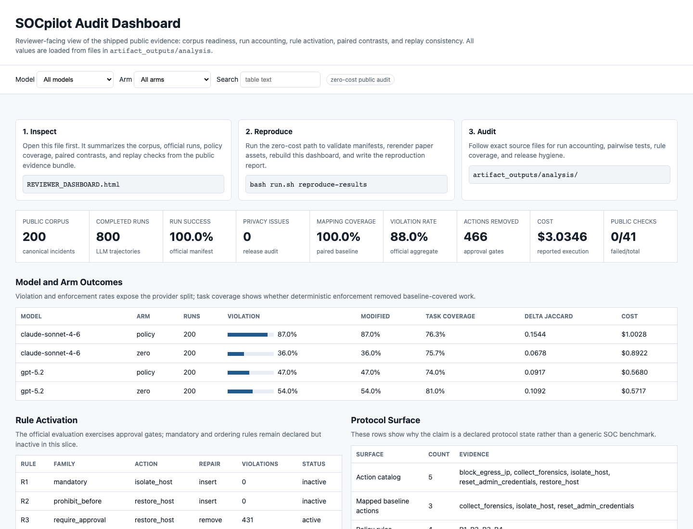

# Artifact Package

This package is the executable SOCpilot artifact. It contains the anonymized
incident dataset, declared policy inputs, verifier, experiment scripts, and
non-private analysis outputs needed to reproduce the reported results.

The manuscript is submitted separately to the venue. The artifact is the program
and data boundary that reviewers use to validate the experiments. It does not
include author-only resources such as `literature/`, `project-framework/`,
private notes, raw exports, local provider payloads, or credentials.

## Environment setup
Create and activate a virtual environment inside this package before running the
checks below. The bundled `run.sh` already exposes the packaged `src/` tree and
auto-detects `.venv/` when present, so you only need the dependencies.

```bash
python3 -m venv .venv
source .venv/bin/activate
.venv/bin/pip install -r requirements.txt -r requirements-dev.txt
```

## Recommended verification order
Open `REVIEWER_DASHBOARD.html` first when reviewing a downloaded copy of this
package. It is a static, self-contained entry point for the public evidence
surface: corpus readiness, official run accounting, policy coverage, paired
contrasts, replay stability, and direct links to the files behind the paper
claims. Regenerate it with:



```bash
bash run.sh reproduce-results
```

This zero-cost command validates the public artifact, regenerates the paper
tables and figures from shipped public analysis bundles, writes a reproduction
report, and renders both `REVIEWER_DASHBOARD.html` and
`artifact_outputs/dashboard/index.html`. To run only the integrity and dataset
checks, use `./run.sh validate-public-artifact`.

The validation path runs artifact integrity checks, dataset audit, global-artifact
assessment, and release-hygiene rechecks and writes fresh verification reports
under `artifact_outputs/analysis/`.
When `official_llm_analysis_bundle.json` is present, the command also rechecks
that the sanitized official row-level metrics agree with the shipped official
summary, run manifest, and paired-test rows.
Local transient files such as `.venv/` and `__pycache__/` are ignored by
the release-surface checks for the packaged public path.
It also verifies that `artifact_outputs/analysis/protocol_freeze.json` points
to packaged files whose SHA-256 digests match the published bundle.
The public package does not include raw paid LLM prompts, provider payloads, or
local execution snapshots. Reviewers who want to rerun provider calls can add
their own keys using `config/models.example.yaml` as the template and execute a
separate, clearly labeled run. Its shipped analysis outputs are the non-private
outputs included at packaging time, including the human-baseline analysis
bundle, sanitized official row-level metrics, copied official summary, and
paired-test rows used for auditability. When present, the packaged
`artifact_outputs/analysis/repeat_stability/` directory also exposes the
non-private stability summaries used by the paper's robustness discussion.

Readers should interpret the frozen rule surface and the observed rule slice
together: the official summary reports observed violations only for the
approval-gated rules (`R3`, `R4`). `R1` remains globally active but is keyed to
a narrow reverse-shell signature absent from the frozen incident slice, and `R2`
requires restoration without earlier forensics, which does not occur in the
reported freeze.

## Package layout
- `artifact_data/`: anonymized incident dataset and frozen global policy inputs
- `artifact_outputs/analysis/`: non-private analysis outputs and the official protocol manifest
- `src/`, `scripts/`, `config/`, `local_redaction/`: reproducibility code and frozen mapping contract

Use `ARTIFACT_README.md` for the high-level package summary and `EVAL_PROTOCOL.md` for the frozen evaluation setup. The frozen model registry is recorded in `config/models.freeze.yaml`; local execution overrides are intentionally excluded.
